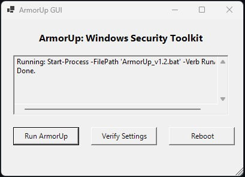

# ArmorUp
Comprehensive Windows Security and Privacy Toolkit – Ideal for Schools, Students, and General Users.
---

## Overview
ArmorUp is a lightweight and effective toolkit designed to rapidly enhance the security and privacy of Windows 10 and Windows 11 systems. It focuses on disabling legacy vulnerabilities, improving privacy settings, enforcing secure system behavior, and ensuring critical updates are installed — all in a single streamlined process.

---

## Why ArmorUp?

Modern education and everyday environments face constant cybersecurity threats. ArmorUp addresses this by:

- **Reducing the system's attack surface**: ArmorUp disables vulnerable legacy protocols like NetBIOS, SMBv1, LLMNR, AutoPlay, and Remote Assistance, significantly lowering the risk of remote attacks and malware infiltration.
- **Enhancing user privacy and protecting personal information**: By disabling Telemetry, Advertising ID, Location Services, and enabling DNS over HTTPS (DoH), ArmorUp ensures that user activities and location data are kept private.
- **Protecting against ransomware and physical access attacks**: Controlled Folder Access is activated to protect important folders from ransomware attacks, while screen lock policies with password protection prevent unauthorized physical access.
- **Ensuring devices stay updated and resilient**: Automatic triggering of Windows Update ensures critical patches are installed, maintaining system integrity against known vulnerabilities.

ArmorUp is designed to be simple, fast, and effective — ideal for students, teachers, IT administrators, and everyday users.

---

## What Makes ArmorUp Special?

###   Tailored for Schools and Students
- Specifically built for education environments and general users.
- No unnecessary complexity or enterprise-only focus.

###   Complete Automation
- Combines Windows Update and Security Hardening in a single step.

###   Professional Quality Documentation
- Clear README, usage manuals, and a security guide.

###   No Third-Party Dependencies
- No installations required; fully native batch and PowerShell scripts.

###   Multi-Layered Security
- Covers network protocols, privacy settings, ransomware protection, and physical security.

###   Lightweight and Fast
- Executes quickly without slowing down the system.

###   Open Source and Globally Accessible
- Open under the MIT License for everyone to use, modify, and improve.

> **ArmorUp bridges the gap between basic users and professional-grade security — without complexity.**

---

## Contents

- `ArmorUp_Security_Complete_v1.0.bat` — Legacy version of the security hardening script.
- `ArmorUp_Security_Complete_v1.1.bat` — Latest version with full security and privacy improvements.
- `Enhanced_Security_Check_Script.ps1` — PowerShell script to verify the applied security settings.
- `ArmorUp_GUI.ps1` — Python-based GUI launcher for the security hardening toolkit.
- `LICENSE` — MIT License (open-source, free to use and modify).

---

## Security Enhancements Applied

**The following critical security settings are applied and verified:**

- **NetBIOS**: Disabled — Prevents legacy network attacks.
- **LLMNR**: Disabled — Blocks local network name spoofing attacks.
- **Advertising ID**: Disabled — Enhances privacy by disabling tracking.
- **Telemetry**: Disabled — Prevents sending diagnostic data to Microsoft.
- **Location Services**: Disabled — Protects physical location privacy.
- **DNS over HTTPS (DoH)**: Enabled — Encrypts DNS queries for better privacy.
- **SMBv1**: Disabled — Removes obsolete and vulnerable protocol.
- **Remote Assistance**: Disabled — Prevents unauthorized remote control access.
- **AutoPlay/AutoRun**: Disabled — Blocks malware from USB and external devices.
- **Screensaver Activation**: Enabled — Ensures device locks after inactivity.
- **Screensaver Password Lock**: Enabled — Requires authentication to unlock.
- **Screensaver Timeout**: Set to 10 minutes — Balances security and usability.
- **Controlled Folder Access**: Enabled — Defends critical folders against ransomware.

---

## How to Use

### 1. Preparation
- Log in as an administrator.
- Ensure your device has an internet connection.

### 2. Running ArmorUp (CLI method)
- Right-click `ArmorUp_Security_Complete_v1.1.bat` and select **Run as administrator**.
- Allow the script to complete:
  - Windows Update will be triggered.
  - Security configurations will be automatically applied.
- **Reboot your computer** after the script finishes.

### 3. Verifying Security
(Optional but recommended)

- If your system blocks running `.ps1` scripts, open PowerShell and run:
  ```powershell
  Set-ExecutionPolicy -Scope Process -ExecutionPolicy Bypass
  ```
- Then, right-click `Enhanced_Security_Check_Script.ps1` and select **Run with PowerShell**.
- Confirm that all security settings are correctly applied.

---

## GUI Version (Optional)

ArmorUp includes an optional graphical user interface (GUI) for simplified interaction.

**Features:**
- One-click execution of `ArmorUp_Security_Complete_v1.1.bat`
- Run security verification script
- Reboot button for convenience
- Real-time console output feedback

> Built with native PowerShell and Windows Forms — no external dependencies required.

### Screenshot



> To launch the GUI, right-click `ArmorUp_GUI.ps1` and select **Run with PowerShell**.

---

## Requirements

- Windows 10 (version 1809 or newer) or Windows 11
- Local Administrator privileges
- Internet access for updates

---

## License

This project is licensed under the **MIT License**.
You are free to use, modify, and distribute with proper attribution.

---

## Maintained by
**NorHackCERT**  
Global community initiative focused on cybersecurity for education and resilience.

> "Stay safe. Stay armored. #ArmorUp"

---
